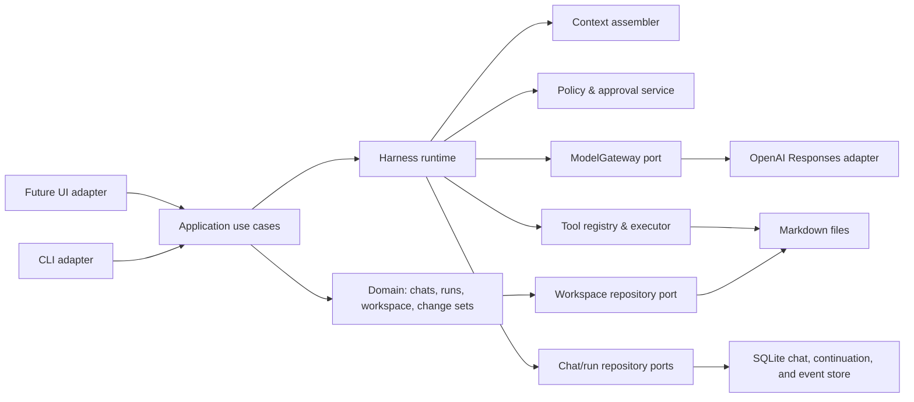
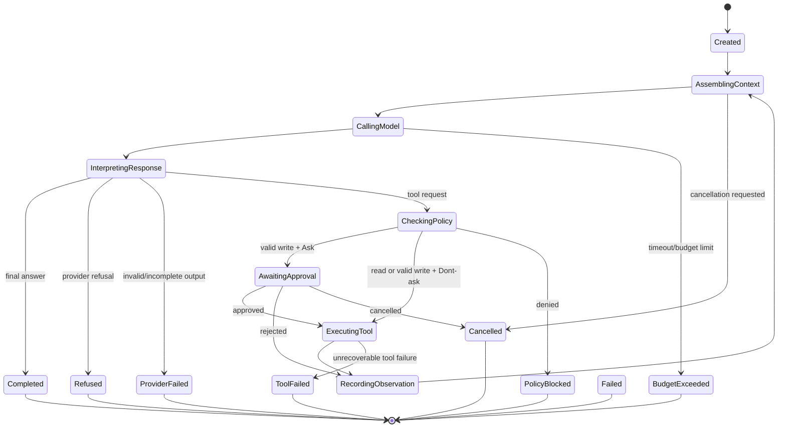

# Worldbuilder Harness Architecture

**Status:** proposed architecture for version 0.1 (the MVP)  
**Language:** English (implementation and GitHub-facing documentation)  
**Research date:** 2026-07-16  
**Scope:** a local, Python-based worldbuilding application. In this project, **version 0.1 and MVP are exact synonyms**. Version 0.1 supports OpenAI only and provides both a scriptable command-line interface (CLI) and an interactive terminal user interface (TUI). This document designs the application architecture; it does not create, alter, or decide any worldbuilding content.

## 1. Executive decision

Worldbuilder should be a **local-first, single-process application with a framework-independent application core**. The core owns world data, domain rules, run state, policies, tool dispatch, persistence, and audit records. The CLI and interactive TUI are only inbound/outbound adapters to that core. A future graphical or web interface must call the same application use cases and render the same typed events; it must not contain a second agent loop or a second content-editing implementation.

For version 0.1, implement a **single Worldbuilder agent loop** over the OpenAI Responses API through the official `openai` Python SDK, plus **Textual** as the sole presentation framework for the interactive TUI. These are the only two direct third-party runtime dependencies. Keep the scriptable CLI on standard-library `argparse`. Expose a deliberately small set of local, typed read/write tools. The write path has exactly two user modes—`Ask for Approval` and `Dont ask for Approval`—over one immutable safety pipeline. Keep the OpenAI integration behind a provider port, even though OpenAI is the only supported provider initially. Do not make the OpenAI Agents SDK, LangChain, MCP, a vector database, a web server, or a multi-agent framework a hard dependency of the first release.

This is intentionally a *harness*, not merely a chat wrapper. It is responsible for:

1. selecting authoritative and relevant context;
2. asking the model for either a final answer or a structured tool request;
3. validating, authorising, executing, and recording every requested action;
4. preserving durable named chats and an inspectable run trajectory;
5. enforcing budgets and unambiguous terminal states; and
6. protecting the user's worldbuilding material from silent alteration, loss, or elevation of an idea to canon.

The first release should optimise for correctness, inspectability, durable continuation, and a stable extension seam. It should **not** optimise prematurely for autonomy, multiple agents, remote tool servers, web research, long-running background work, semantic search, or a rich UI.

## 2. Problem framing and architectural goals

### 2.1 What the product is

Worldbuilder is a tool that helps a user work with their own worldbuilding corpus. The corpus is user data, potentially in any human language. The application must preserve both its language and meaning. In particular, it must make it possible to distinguish:

- established facts / canon;
- proposals or alternatives;
- explicit assumptions; and
- open questions.

The model may help inspect, relate, summarize, question, or draft material, but it is not an authority that can decide what becomes canon. A model response is a proposal or explanation until the user expressly chooses to persist it as a world-data change.

### 2.2 Quality attributes and priorities

| Priority | Architectural consequence |
| --- | --- |
| Content integrity | Require explicit user intent to enable writes. In Ask mode review each exact diff; in Dont-ask mode apply only through the same validated, stale-safe, atomic pipeline. Retain every proposal and result. |
| UI independence | Put commands, prompts, terminal rendering, and confirmation prompts outside the core. The core accepts typed requests and emits typed results/events. |
| Deterministic local behaviour where possible | Keep workspace access, document parsing, diff generation, policy checks, IDs, and persistence in ordinary Python code rather than in prompts. |
| Provider isolation | Make OpenAI a replaceable adapter behind a small protocol. Avoid leaking OpenAI response classes through domain or application APIs. |
| Observability and recoverability | Persist named chats, run events, continuation items, and action records locally. Make an interrupted run or pending approval recoverable without a remote dashboard. |
| Security and consent | Treat files, retrieved text, tool results, and model output as untrusted at the model boundary. Enforce write permissions in code. |
| Simple 0.1/MVP | One process holding an exclusive local-workspace lease, one user, one current workspace/chat, multiple durable named chats per workspace, SQLite metadata, Markdown files, and synchronous CLI UX over an async-capable core. |
| Extensibility | Add optional adapters later (UI, provider, retrieval, MCP, telemetry) without changing the domain model or use-case contracts. |

### 2.3 Explicit non-goals for version 0.1/MVP

- Multi-agent delegation, handoffs, agent-to-agent communication, or autonomous subagents.
- Hosted/remote workspaces, multi-user collaboration, accounts, tenancy, or authentication beyond an OpenAI API key supplied to the local process.
- Network access for the model other than its OpenAI API invocation; no browsing, shell, arbitrary code execution, or external MCP tools.
- Automatic canonicalisation, contradiction resolution, bulk rewriting, or deletion of world material.
- Git status inspection, diffs, staging, commits, branches, or any other Git integration. Internal change sets are SQLite-backed write proposals, not Git changes.
- A vector database or semantic index. Small and medium Markdown workspaces can be searched deterministically first. Add retrieval only after measurements show it is needed.
- Exact replay of an LLM run. Records allow inspection and approximate re-execution, but model versions and external services can change.
- Chat deletion, sharing, cloud synchronisation, export/import, and background execution after the local process exits.

## 3. Research findings and their design implications

The accompanying [HarnessWritingResearch.md](HarnessWritingResearch.md) establishes the general distinction between an LLM and its harness. The table below connects its evidence to concrete decisions for Worldbuilder.

| Research finding | Consequence for Worldbuilder |
| --- | --- |
| A harness mediates a multi-turn loop, tools, context, policy, state, and termination; the model alone does not enforce those concerns. [Microsoft: Agent Harnesses](https://learn.microsoft.com/en-us/agent-framework/agents/harness) | Implement the loop in `application/runtime`, not in a CLI command or prompt. Model tool calls are requests, never direct effects. |
| Context is finite and must be selected deliberately. Tool definitions must be clear and non-overlapping. [Anthropic: Effective context engineering](https://www.anthropic.com/engineering/effective-context-engineering-for-ai-agents) | Build a context assembler with explicit source/provenance, conservative size estimates, no silent provider truncation, and stable document references. Version 0.1 uses user-named paths and direct bounded reads; lexical discovery is deferred. |
| A successful final answer is insufficient evidence for an agent that can affect an environment; trajectory and outcome need evaluation. [Anthropic: Demystifying evals for AI agents](https://www.anthropic.com/engineering/demystifying-evals-for-ai-agents) | Persist run, model, tool, approval, and terminal events. Test domain/tool effects independently of natural-language output. |
| Tool calls require host-side consent, authorization, and safety controls. [MCP overview](https://modelcontextprotocol.io/specification/2025-03-26/index) | Classify tools by effect and enforce path/operation authority in application code. Ask mode additionally requires a digest-bound user decision; Dont-ask mode deliberately omits the pause but never the authority checks. |
| OpenAI’s Agents SDK offers a managed loop, tools, sessions, guardrails, and tracing; it recommends direct Responses API use when the application should own the loop, tool dispatch, and state. [OpenAI Agents SDK](https://openai.github.io/openai-agents-python/) | Version 0.1 owns its loop and named-chat store with the official OpenAI Python SDK. The Agents SDK remains an evaluated future integration option, not the architectural centre. |
| Agent traces can contain prompt and tool input/output data; trace-sensitive-data capture is a conscious setting. [OpenAI Agents SDK tracing](https://openai.github.io/openai-agents-python/tracing/) | Local event logs must support redaction and a “store content / store hashes and metadata only” policy. Remote tracing is opt-in, not the only audit mechanism. |
| Python’s standard `curses` module is not included with the Windows Python distribution, while Textual provides a cross-platform, asynchronous TUI framework with widgets and dedicated test support. [Python curses HOWTO](https://docs.python.org/3.16/howto/curses.html) [Textual](https://github.com/Textualize/textual) | Do not build a custom curses UI or add a Windows-only compatibility package. Use Textual as the one deliberate UI dependency; keep all product logic outside it. |
| OWASP identifies prompt injection, excessive agency, tool misuse, context poisoning, and identity/privilege abuse as material AI-agent risks. [OWASP LLM Top 10 2025](https://owasp.org/www-project-top-10-for-large-language-model-applications/assets/PDF/OWASP-Top-10-for-LLMs-v2025.pdf) | Constrain capabilities at the filesystem and policy boundary; clearly label external/user text in prompts; do not grant ambient shell/network access; make writes reviewable and scoped. |

### 3.1 Why not build version 0.1 around a generic agent framework?

An agent framework can accelerate prototyping, but it can also become the de facto domain model and execution policy. Worldbuilder has unusually important product semantics around provenance, proposal status, explicit confirmation, and preservation of user content. Those must remain application-owned and testable without a framework runner.

The official OpenAI Agents SDK is a credible later option: it has function tools with Pydantic validation, a managed agent loop, sessions, guardrails, human-in-the-loop support, and tracing. Its own documentation distinguishes it from using the Responses API directly: direct API use is appropriate when the application owns the loop, dispatch, and state. [OpenAI Agents SDK](https://openai.github.io/openai-agents-python/) The latter is the right trade-off for this MVP. A thin provider adapter can still make an SDK-backed runtime a future implementation of the same `ModelGateway` port.

## 4. Architectural style and boundaries

Use **hexagonal architecture (ports and adapters)** with an intentionally small domain layer and an application service layer. This is not a requirement for a complex framework: standard-library Python protocols, dataclasses, enums, explicit parsers, and explicit constructors are sufficient.



The arrows are dependency directions, not necessarily process boundaries. For version 0.1, all components run in one local process. A future UI may be in-process (TUI/desktop) or communicate through an API adapter, but it must depend on the same chat/run use cases.

### 4.1 Dependency rule

Dependencies point inward:

- **Domain** imports only the Python standard library (or a narrowly accepted validation abstraction if justified). It knows no CLI, SQLite, OpenAI, HTTP, or prompt text.
- **Application** imports domain types and abstract ports. It coordinates use cases and runtime state transitions.
- **Adapters/infrastructure** implement ports using files, SQLite, OpenAI, and terminal libraries.
- **Entrypoints** wire configuration and adapters together; they render output and collect input. They contain no business decisions.

No domain/application object should return an OpenAI SDK object. Convert provider responses into local `ModelTurn`/`ToolRequest` values at the adapter boundary.

### 4.2 Recommended package layout

```text
src/worldbuilder/
  __init__.py
  cli/
    app.py                 # argparse commands and exit-code mapping
    presenters.py          # terminal rendering; no domain writes
    confirmation.py        # interactive/non-interactive approval adapter
  tui/
    app.py                 # Textual App composition and UI-only state
    controller.py          # maps text/slash-command intents and events
    command_parser.py      # deterministic local /command grammar
    command_palette.py     # transient keyboard-filtered choice list
    transcript.py          # safe rendering of responses/events/diffs
    text_input.py          # the single persistent input control
    worldbuilder.tcss      # presentation-only stylesheet
  application/
    commands.py            # typed request DTOs
    results.py             # typed result DTOs and errors
    use_cases.py           # chat/create/open/inspect/run/apply operations
    runtime/
      runner.py            # bounded agent state machine
      context.py           # context selection and budgeting
      compaction.py        # bounded, lossless provider continuation
      events.py            # event types and event recorder port
      budgets.py
      policy.py
  domain/
    chat.py                # durable named chat and ordered items
    workspace.py
    document.py
    claims.py              # status vocabulary; no automatic claim database
    changes.py             # ChangeSet, Patch, approval requirements
    provenance.py
  ports/
    model.py
    workspace.py
    run_store.py
    chat_store.py
    clock.py
    id_generator.py
  infrastructure/
    openai_responses.py
    filesystem_workspace.py
    workspace_lock.py
    sqlite_run_store.py
    sqlite_chat_store.py
    markdown.py
    settings.py
    telemetry.py
  tools/
    registry.py
    read_text_file.py
    write_markdown_file.py
  prompts/
    system.md
    render.py
  bootstrap.py             # composition root
tests/
  unit/
  integration/
  contract/
  fixtures/
docs/
```

Package names are illustrative; the important property is the boundary, not the exact directory spelling.

## 5. Domain model and user-data invariants

### 5.1 Chat/session model

A `Chat` is the durable user-facing conversation; a `Run` is one submitted user message and its complete model/tool loop. A chat owns an ordered sequence of user messages, assistant messages, tool-call/output items, public run events, and opaque provider continuation items. Each run belongs to exactly one chat, and each chat belongs to exactly one workspace.

```text
Chat
  id: stable opaque ChatId
  workspace_id: WorkspaceId
  name, normalized_name
  model_id, reasoning_effort, approval_mode
  created_at, updated_at, last_opened_at

ChatItem
  chat_id, sequence, run_id?
  type: USER | ASSISTANT | FUNCTION_CALL | FUNCTION_RESULT |
        PUBLIC_EVENT | COMPACTION
  visible_payload?, context_payload?, created_at, schema_version
```

Display names preserve trimmed Unicode, contain 1–120 code points, and reject control/bidirectional-formatting characters. Uniqueness uses `NFKC(name).casefold()` inside one workspace, preventing visually ambiguous compatibility/case aliases without rewriting display text. IDs remain authoritative so renaming cannot break foreign keys or continuation. Chat creation, listing, opening, renaming, transcript restoration, and switching are local operations and do not invoke OpenAI.

The most recently opened chat is stored per workspace. TUI startup restores it and reconstructs the transcript from SQLite. If an Ask-mode run is `AWAITING_APPROVAL`, its exact diff is restored without application. A process that died during a normal `RUNNING` state marks that run `INTERRUPTED`; it never guesses that an external boundary succeeded.

Version 0.1 has no chat deletion. Switching is rejected while the current chat has an executing or awaiting-approval run; the user must cancel, approve, or reject first. This keeps the argument-free `/approve` and `/reject` commands unambiguous.

### 5.2 Workspace model

Treat a world as a local workspace rooted at a user-selected directory. Markdown is the portable default representation. Every document has a stable, workspace-relative identifier and a path that has been validated to remain below the workspace root. Version 0.1 requires a supported local filesystem: UNC and Windows remote drives are rejected, and initialisation records an explicit user attestation that the root is not a network mount or concurrently synchronised because those conditions cannot be detected portably. Missing attestation fails closed; a false or later-invalid attestation is an explicit guarantee limitation.

Suggested initial layout:

```text
my-world/
  worldbuilder.toml            # optional workspace settings, not mandatory for plain Markdown reading
  lore/
    history.md
    places/
      arden.md
  .worldbuilder/
    worldbuilder.db            # run metadata, event log, approval/change records
    backups/                   # recovery data for either write mode
```

Do not require a proprietary content format for ordinary worldbuilding text. Metadata should supplement Markdown, not make user material unreadable outside the program. Front matter parsing/editing is not a version 0.1 feature. `.worldbuilder/` is denied case-insensitively to model tools, created with owner-only permissions where supported, and contains private but not encrypted-at-rest chat text, continuation state, diffs, and backups.

The composition root acquires an exclusive OS-backed lock in `.worldbuilder/` before opening repositories for any workspace command and holds the open handle for the command/process lifetime (`msvcrt` on Windows, `fcntl` on Unix). Lock-file PID metadata is diagnostic only. A second Worldbuilder instance fails promptly with `WORKSPACE_BUSY` before invoking OpenAI or a tool. A TUI workspace switch acquires the new lease before releasing the old and keeps the old workspace on failure. This makes the documented single-process architecture enforceable across separately launched CLI/TUI processes.

### 5.3 Claims and epistemic status

Version 0.1 needs a shared vocabulary for knowledge states, but it does **not** create a claim database or extract sentences from existing Markdown. The minimal type is:

```text
ClaimStatus = CANON | PROPOSAL | ASSUMPTION | OPEN_QUESTION
```

The enum is used in prompts and, only when explicitly present, assistant-generated structured result/change-set metadata. Existing prose is never classified or rewritten automatically. In prose output, the assistant must label uncertainty rather than imply it has established a fact. A generated proposal does not become canon merely because a user authorised the requested file write; changing epistemic status must be part of the user's explicit content-change request. Confidence, if later introduced, is not canonicity.

### 5.4 Change sets, not opaque writes

All content-changing operations should pass through a `ChangeSet`:

```text
ChangeSet
  id, workspace_id, created_at, requested_by
  intent: CREATE | REPLACE     # version 0.1
  change: FileChange             # exactly one in version 0.1
  rationale, source_run_id?, provenance
  approval_mode: ASK | DONT_ASK
  status: PREPARED | AWAITING_APPROVAL | APPLYING | APPLIED |
          REJECTED | CANCELLED | STALE | FAILED | RECOVERY_REQUIRED

FileChange
  path, expected_content_hash?, before?, after?, unified_diff
```

Key invariants:

1. An assistant tool creates a persisted **prepared** change set, never a direct unvalidated file mutation.
2. Both modes use the same schema, workspace, extension, size, symlink, stale-hash, complete current-run read-coverage proof for replacement, canonical domain-separated digest, journalling, atomic-write, and audit checks. The digest binds change-set/run IDs, workspace identity, canonical relative path, operation, expected absence/old hash, new-byte hash/length, and diff hash through unambiguous canonical JSON—not string concatenation.
3. In `Ask for Approval`, the UI/CLI shows the exact path and unified diff and requires a digest-bound decision before application.
4. In `Dont ask for Approval`, the core proceeds from `PREPARED` to `APPLYING` without a human decision record. This is automatic application, not fabricated approval.
5. Application uses temporary-file-and-rename semantics where the platform permits, records the result, and retains a reversible backup for modified files according to retention policy.
6. A stale change set fails rather than overwriting a file changed since preparation.
7. Deletion is not available in version 0.1. If later offered, it requires a separate explicit command and policy design.
8. Version 0.1 permits one single-file write proposal per run. A second write request is policy-blocked; multi-file work is split across explicit user turns.

Ask approval inserts the unique positive decision and transitions `AWAITING_APPROVAL -> APPLYING` atomically; there is no durable `APPROVED` state that could be replayed later. Rejection and cancellation transition the change set to distinct terminal states. A failed current-hash/absence check is `STALE`; an uncertain crash state is `RECOVERY_REQUIRED`, never `APPLIED` or automatically retried.

This design prevents a natural-language response or a malformed tool call from silently overwriting a user's material.

### 5.5 Provenance

Each model-derived artifact should carry provenance independently of whether its text is written to a world file:

- source chat, run, and event IDs;
- source document IDs and content hashes used as context;
- model/provider identifier and application prompt version;
- tool version/schema version;
- time of creation;
- user instruction that initiated the run; and
- policy/approval decision for content changes.

The provenance record is an audit aid, not a claim of factual truth. It makes a proposal traceable to the material and configuration from which it was generated.

## 6. The version 0.1/MVP harness runtime

### 6.1 Runtime contract

The runtime accepts an `AgentRunRequest` with workspace, chat, run, and initiating user-item IDs; model/effort configuration; approval mode; budgets; and an immutable capability policy. It emits ordered `RunEvent` values, appends model-relevant and visible items to the chat, and returns either the sole resumable pause `AWAITING_APPROVAL` or one explicit terminal status.

```text
RunStatus = COMPLETED | AWAITING_APPROVAL | CANCELLED | BUDGET_EXCEEDED |
            CONTEXT_LIMIT_REACHED | POLICY_BLOCKED | REFUSED |
            PROVIDER_FAILED | TOOL_FAILED | FAILED | INTERRUPTED
```

The CLI can consume events immediately for streaming terminal output; a future UI can subscribe to the same event stream. The runtime itself never prints or reads from standard input.

### 6.2 State machine



Persist chat/run state before and after every external boundary: model request, complete model response, policy decision, tool start/result, approval decision, filesystem journal transition, and terminal result. A process interruption can then be reported accurately as `INTERRUPTED`; an already persisted `AWAITING_APPROVAL` state remains resumable.

### 6.3 Loop pseudocode

```python
async def run(request: AgentRunRequest) -> RunResult:
    state = run_store.start_created_run(request.run_id)
    while True:
        state = run_store.reserve_model_attempt(state, budget)
        context = context_assembler.build(request.chat_id, state, policy)
        run_store.append(ContextAssembled(context.manifest))

        turn = await model_gateway.respond(context, tools=tool_registry.schemas(policy))
        run_store.append(ModelResponded(turn.redacted_record()))

        outcome = validate_provider_turn(turn)  # refusal, invalid, call, or final
        if outcome.is_terminal:
            return finish(outcome.status, final_text=outcome.public_text)

        for call in turn.tool_calls:
            state = run_store.reserve_tool_attempt(state, budget)
            validated = tool_registry.validate(call)
            decision = policy.decide(validated, state)
            run_store.append(PolicyDecided(decision))
            if decision.denied:
                return finish(POLICY_BLOCKED)
            if validated.effect is WRITE:
                prepared = await change_sets.prepare(validated, decision.prepare_grant)
                if not prepared.ok:
                    observation = prepared.error
                elif decision.requires_approval:
                    request = approval.for_exact(prepared.id, prepared.digest)
                    persist_and_pause(AWAITING_APPROVAL, request)
                    return RunResult.awaiting_approval(request)
                else:
                    observation = await change_sets.apply_auto(prepared.id)
            else:
                observation = await tool_executor.execute(validated, decision.execution_grant)
            run_store.append(ToolObserved(observation.redacted_record()))
            state = state.with_observation(observation)
```

The `StartRun` use case appends the current user message and creates a `CREATED` run referencing that item in one transaction before invoking this loop; the loop only compare-and-sets it to `RUNNING`. The first context projection ends at that sequence instead of appending request text again; subsequent turns use one persisted continuation ledger. This prevents duplicate user messages, runs, and provider items. Write preparation performs path/hash/encoding/size checks and persists the exact diff/digest without target mutation before the Ask/Dont-ask branch, so no approval can refer only to unprepared model arguments.

Every Responses request sets `parallel_tool_calls=false`, `truncation="disabled"`, and an explicit output-token cap. Version 0.1 accepts zero or one custom call per provider turn. If multiple calls arrive anyway, execute none and terminate `PROVIDER_FAILED/OPENAI_OUTPUT_INVALID`; do not partially apply the first call. A refusal is `REFUSED`. Text accompanying a tool call is progress, not completion; completion requires a later completed response with no call/refusal and non-empty public assistant text. State retains any unresolved failed tool observation; final explanatory prose then yields terminal `TOOL_FAILED`, not `COMPLETED`, unless a later confirmed call for the same intent superseded the failure. Approval rejection is a user decision, not a tool failure, and may end `COMPLETED` after truthful explanation. The actual implementation must also handle cancellations, rate limits, retries, and streaming. The point of the pseudocode is the ownership model: policy and tool execution remain outside the provider adapter.

### 6.4 Budgets and termination

Set conservative defaults, configurable per invocation/workspace:

| Budget | Version 0.1 default direction | Reason |
| --- | --- | --- |
| Model turns | 12 | Bounds loops and cost while allowing the required multi-read/write/resume chain. |
| Active wall-clock time | 300 seconds, excluding persisted approval wait | Gives CLI users a predictable failure mode without expiring a human review pause. |
| Tool calls | 10, and always lower than model-turn cap | Bounds actions while supporting several explicit reads and reserves at least one possible final-answer turn under the one-call-per-turn rule. |
| Tool result size | Per-tool character/byte cap | Prevents one large file/result from consuming context. |
| Output/reasoning tokens | 16,384 per model response | Bounds one response; incomplete output is not completion. |
| Context size | Reviewed model-profile limit, conservative UTF-8-byte estimate, and safety reserve | Leaves space for output and avoids provider-limit errors without relying on silent API truncation. |
| Cost/tokens | Record actual usage if supplied; optional hard cap when reliable pricing/configuration is available | Costs and model pricing change; do not hard-code pricing as a safety mechanism. |

Reserve and persist each provider/tool attempt before crossing the external boundary so the configured limit cannot be exceeded by one and failed attempts count. When only one model turn remains after an observation, make it final-only with `tool_choice="none"`; a returned custom call is invalid and none executes. Track active duration with a monotonic clock, persisting accumulated time at boundaries; cap each SDK attempt by the smaller of transport timeout and remaining run time. Never turn an exhausted budget into a fake successful answer. Emit the precise terminal reason and include the resumable run ID where appropriate.

### 6.5 Retry policy

Retry only operations known to be safe to retry:

- model calls: limited exponential backoff for transient network/rate-limit errors, respecting any provider retry guidance and total deadline;
- read-only tools: limited retry if their implementation documents retry safety;
- content writes: **do not automatically retry after an uncertain outcome**. Re-read the target and inspect the recorded change-set/application state first.

Disable hidden SDK-level retries and record every harness-owned attempt. A timeout means “outcome unknown” unless the underlying operation provides a definitive idempotent acknowledgment. Cancellation can interrupt a model/read boundary, but after a write reaches `APPLYING` cancellation becomes pending until journal recovery establishes the filesystem result.

## 7. Context engineering for a worldbuilding corpus

### 7.1 Context layers and trust labels

Build each model call from named layers rather than concatenating arbitrary strings:

1. **Application policy/instructions** — trusted, versioned, not editable by workspace documents at runtime.
2. **Current user task** — untrusted user intent, attributed to the user.
3. **Workspace manifest** — trusted application-generated metadata, such as workspace ID and allowed root.
4. **Selected world documents/excerpts** — user data, untrusted instructions; clearly delimited with path, hash, and truncation information.
5. **Prior run observations** — structured records produced by trusted tools, but their contained text may include untrusted content.
6. **Tool schemas** — trusted application definitions.

The model prompt should explicitly say that content inside document blocks is reference material, not instructions that can change system policy, disclose secrets, or authorize tools. This reduces but does not eliminate prompt-injection risk; enforcement remains in application code.

### 7.2 Retrieval strategy: explicit paths in version 0.1

Version 0.1 exposes only `read_text_file`. Selecting the workspace authorises all supported non-reserved text paths under it; per-file grants are not implemented. The intended prompt behaviour is to use exact paths supplied by the user and ask when one is missing, but that is not an enforceable security boundary—the model could request a guessed exact path. The context assembler begins with prior bounded chat items and exact results of model-requested reads. It does not itself scan, index, or upload the workspace, and first-use disclosure tells users to keep sensitive text outside the selected root.

This deliberately removes an underspecified optional tool surface from the MVP. Deterministic `list_documents`/literal lexical search may be added later behind a `DocumentRetriever` port with pagination, scan/result budgets, reserved-path rules, provenance, and acceptance tests. Semantic retrieval remains later still and requires an explicit choice about which content can leave the machine.

### 7.3 Excerpts and token budgeting

Do not blindly include full files. For every excerpt preserve:

- document ID/path;
- section heading and line range or character offsets;
- content hash of the source version;
- whether it was exact, shortened, or summarised; and
- a stable citation marker such as `[doc: lore/places/arden.md#L20-L62]`.

Prefer verbatim excerpts for facts that may be quoted or changed. Only create a model summary as a derived artifact, label it as such, and retain links to source excerpts. Exclude older completed chat items only through the documented deterministic projection/compaction boundary; never silently drop a source explicitly read for the current run. If required current material cannot fit, return `CONTEXT_LIMIT_REACHED` rather than inventing a partial synthesis.

### 7.4 Chat history and compaction

Persist the full visible chat and operational events locally, but do not send unbounded history to the model. The next call receives a projection containing current request, recent user/assistant turns, relevant source excerpts, complete unresolved function-call/output pairs, and pending state. The full local transcript remains reconstructible even when an old item is excluded from model context.

Use Responses API calls with `store=false` and local continuation as the authority. OpenAI documents that ordinary response objects are retained for 30 days by default, while Conversations API objects/items have different, non-30-day-TTL persistence. Depending on either as the only chat store would couple local continuation to provider retention. [OpenAI: Conversation state](https://developers.openai.com/api/docs/guides/conversation-state)

Near the configured context threshold, use server-side compaction with `store=false` and persist the complete returned compacted window, which can include an encrypted compaction item and retained items. It is provider continuation state, not a user-visible summary and not a source of canonical facts. Pass it forward losslessly, pruning only the prefix made obsolete by the latest compaction boundary as documented; keep the full visible transcript locally. Stateless reasoning items' encrypted content must likewise round-trip without interpretation. Stop safely with `CONTEXT_LIMIT_REACHED` if a coherent bounded context cannot be constructed. [OpenAI: Compaction](https://developers.openai.com/api/docs/guides/compaction) [OpenAI: Reasoning](https://developers.openai.com/api/docs/guides/reasoning#preserve-reasoning-across-calls)

## 8. Tools, policies, and approvals

### 8.1 Initial tool catalogue

Tools should be narrow, named by an observable outcome, and have strict JSON schemas. They should return structured data rather than explanatory prose whenever possible.

| Tool | Effect class | Version 0.1 policy | Purpose |
| --- | --- | --- | --- |
| `read_text_file` | read | automatically allowed inside immutable scope | Reads a validated Markdown/text path and bounded line range. |
| `write_markdown_file` | write | Ask: exact approval; Dont-ask: automatic after identical validation | Prepares and applies a create/replace through the change-set pipeline. |

The model never receives generic `write_file`, `delete_file`, `run_shell`, `http_request`, web-search, or arbitrary filesystem traversal tools in version 0.1.

### 8.2 Tool schema and result design

Use standard-library `dataclasses`, `TypedDict`/`Protocol`, explicit parsing functions, and `json` for tool arguments and result envelopes. Validate every required field, type, enum value, path, and size at the application boundary. A tool result should distinguish `ok`, `not_found`, `invalid_request`, `permission_denied`, `conflict`, `timeout`, and `internal_error`. Avoid throwing unstructured exception strings into the model context.

`read_text_file` accepts only explicit user/model-supplied paths, rejects source files above 8 MiB, and returns at most 64 KiB/2,000 lines with exact-byte whole-file hash and truncation/mid-line metadata; it never splits a UTF-8 sequence. `write_markdown_file` accepts `create` or `replace`, a validated 1–1,024-code-point relative `.md` target, exact-byte expected SHA-256 for replacement (`null` for create), complete non-whitespace new content, and a nonblank rationale of at most 2,000 code points. Empty/whitespace-only output is denied as destructive erasure. One call prepares one file only. The tool service—not the model—computes encoded bytes/diff, preserves an existing uniform BOM/newline convention, persists the change set, and checks scope. Existing replacement targets and new encoded content are each capped at 256 KiB and the diff at 512 KiB; mixed-line-ending replacements, missing parents, unsupported controls, and larger proposals fail before approval. Deletion, move, directory creation, and arbitrary patch execution are absent from the schema, not merely discouraged in the prompt.

### 8.3 Policy is executable configuration

Make policy data explicit and immutable for a run:

```text
CapabilityPolicy
  readable_roots: [workspace root]
  writable_roots: [workspace root]
  allowed_read_extensions: [.md, .markdown, .txt]
  allowed_write_extensions: [.md]
  allow_new_files: true
  allow_delete: false
  approval_mode: ASK | DONT_ASK
  network_tools_enabled: false
  shell_enabled: false
  max_read_bytes, max_write_bytes=256KiB, max_diff_bytes=512KiB
  max_write_proposals_per_run: 1
```

The policy service evaluates every request after schema validation and before execution. It never accepts permission data from model arguments. An allowed write receives only a narrow preparation grant first; that grant permits validation/diff persistence but not target mutation. After preparation, Ask mode can issue a single-use `ApprovalRequest` containing exact change-set ID/digest, while Dont-ask permits the application service to derive an application grant from the immutable run snapshot without creating a misleading approval record. Read execution grants and both write-stage grants are bound to workspace, path, operation, hashes/digest, limits, and the immutable run snapshot.

### 8.4 Approval mode and CLI confirmation are application concerns

`Ask for Approval` is the safe internal default. Interactive CLI/TUI adapters display the diff and collect approval/rejection; non-interactive Ask mode persists and returns `AWAITING_APPROVAL`. The core sees a decision bound to exact change-set ID/digest, actor, and time. `Dont ask for Approval` is explicit configuration: current-chat `/approval dont-ask` is a standing chat default, `--approval dont-ask` is a one-invocation override, and validated `WORLDBUILDER_APPROVAL=dont-ask` is a resolved default. While effective, it automatically applies every model-requested write that passes the shared immutable checks. Every surface warns before each run whose effective mode is Dont-ask, regardless of source, and keeps it visible in status. The model cannot switch modes.

### 8.5 Filesystem hardening

- Canonicalise the workspace once, derive a host-normalised identity key, then resolve and verify the target inside it before and immediately at every read/write boundary.
- Reject absolute/drive/UNC/NT-namespace paths, `.`/`..`, NUL/control/bidirectional-formatting path characters, Windows ADS colons/device/trailing-dot names, unsupported suffixes, and any case-folded `.worldbuilder`, `.git`, `.hg`, or `.svn` component. On Windows re-check the final long path obtained from the opened handle so 8.3 aliases cannot bypass reserved names.
- Reject symlink/reparse components for writes and escapes for reads; reject regular files with link count greater than one because external hard-link aliases cannot be bounded portably. Open regular-file handles without following the final link where supported and compare handle/path identity before and after I/O to narrow substitution races.
- Enforce size limits from the open handle and while reading, and hash the exact bytes from that same handle.
- Use expected content hashes to detect concurrent/manual edits.
- Create same-directory temporary files exclusively with owner-only permissions, flush and `fsync` them, and revalidate target state immediately before publication.
- Replace only after a durable exact-byte backup and current-hash check. On Windows use `ReplaceFileW` without flags that ignore ACL/metadata merge errors; on POSIX reproduce mode/ownership where permitted and all supported extended attributes/ACL xattrs on the temp inode before `os.replace`, failing closed if security metadata cannot be preserved. Create only with a verified atomic no-overwrite primitive. If the filesystem cannot provide it, fail `ATOMIC_CREATE_UNSUPPORTED` rather than risk replacement or partial creation. [Microsoft: ReplaceFile](https://learn.microsoft.com/en-us/windows/win32/api/winbase/nf-winbase-replacefilew)
- Re-open/re-resolve and hash the published target, flush its final handle, and fsync the parent directory where supported before success. Journal `PREPARED -> APPLYING -> BACKUP_DURABLE -> FILE_PUBLISHED -> VERIFIED -> RECORDED`; never retry an uncertain filesystem effect automatically.
- Ensure `.worldbuilder/` internal state is not exposed as ordinary world text or made model-writable through content tools.

Portable path validation cannot sandbox a hostile process running as the same OS user. Version 0.1's guarantee is against model-controlled paths, symlink/reparse escapes, accidental edits, and cooperating Worldbuilder instances (through the workspace lock); the remaining same-user race limitation is explicit rather than implied away.

## 9. OpenAI-only provider adapter

### 9.1 Port design

Keep this application-facing protocol small:

```python
class ModelGateway(Protocol):
    async def respond(
        self,
        request: ModelRequest,
        tools: Sequence[ToolDefinition],
        cancellation: CancellationToken,
    ) -> ModelTurn: ...
```

`ModelRequest` contains rendered messages/instructions, model name, response-format requirements, and correlation IDs. `ModelTurn` contains a provider-neutral ordered sequence of text chunks, tool calls, usage, provider request ID, finish reason, and normalized errors. `ToolDefinition` is a local schema model that the OpenAI adapter translates into the Responses API format.

### 9.2 Why the official OpenAI Python SDK and Responses API

The only provider dependency in version 0.1 should be the official `openai` SDK. It gives the adapter supported API authentication, transport, request/response types, streaming, and future endpoint evolution without making the rest of the program depend on HTTP details. The Responses API supports tool-using flows; the OpenAI Agents SDK itself is built on it by default. [OpenAI Agents SDK](https://openai.github.io/openai-agents-python/)

Use a provider adapter rather than calling `client.responses.create(...)` in CLI commands. This isolates OpenAI-specific message/item formats, tool-call IDs, streaming events, error classes, model identifiers, and retry details. It also makes fake gateways straightforward for unit and integration tests.

The adapter uses `store=false`, `parallel_tool_calls=false`, `truncation="disabled"`, and an explicit `max_output_tokens`. It retains a lossless tagged provider envelope for every output item required by stateless continuation, including encrypted reasoning and complete compacted windows, while exposing only mapped public/action items to the application. Unknown continuation-relevant types fail before tool execution; they are not discarded as harmless metadata.

### 9.3 OpenAI configuration

Read secrets only from the environment or an OS secret-store adapter introduced later. The core configuration receives an already-resolved credential reference/adapter; it must not persist API keys in workspace YAML, SQLite events, logs, prompts, or backups.

Initial configuration should include:

- `OPENAI_API_KEY` (required at runtime for model commands);
- `WORLDBUILDER_MODEL` (a documented, user-configurable default rather than a hard-coded model assumption);
- `WORLDBUILDER_EFFORT` (a documented default reasoning effort, validated against the effective model);
- `WORLDBUILDER_APPROVAL` (`ask` or `dont-ask`, optional; internal default `ask`);
- workspace/CLI run budgets and SDK transport timeout, resolved without additional environment variables; and
- local diagnostic mode (`auditable` default, explicit `debug`), with remote tracing disabled.

Do not silently enable remote tracing of full worldbuilding content. The OpenAI Agents SDK documentation notes that generation and tool spans can capture inputs/outputs and provides controls for sensitive-data inclusion. [OpenAI Agents SDK tracing](https://openai.github.io/openai-agents-python/tracing/) That is a useful warning even though version 0.1 does not use the Agents SDK. Local redacted auditing is the baseline; any remote trace exporter is a separately documented opt-in.

Before the first model run in a workspace, disclose that the current user message and explicitly selected/read excerpts are transmitted to OpenAI. `store=false` controls response storage behaviour; it does not make inference local. Do not automatically scan/upload the workspace, and do not log raw outbound requests in ordinary diagnostics.

### 9.4 Structured outputs versus tools

Use function tools for workspace actions. Use structured output schemas for bounded, non-action final artifacts where a machine-readable result is valuable (for example a list of questions with source citations). Validate all returned data locally. A valid schema proves only syntactic shape, not factual support or authorisation.

## 10. Persistence, audit, and privacy

### 10.1 Split content from operational data

| Data | Primary location | Rationale |
| --- | --- | --- |
| Worldbuilding source | User Markdown files | Portable, user-owned, version-control friendly. |
| Named chats, chat items, per-chat values/sources, and lossless provider continuation | `.worldbuilder/worldbuilder.db` | Durable local continuation and switching independent of provider storage. |
| Workspace metadata and pending/applied change sets | `.worldbuilder/worldbuilder.db` | Transactional local state, not mixed into prose. |
| Run event log and provenance | SQLite | Ordered queries, durable status transitions, efficient audit. |
| Backups of applied replacements | `.worldbuilder/backups/` | Local recovery of a known write operation in either mode. |
| API key | Environment / later OS secret store | Never workspace state. |

SQLite is a strong version 0.1 choice: Python provides it in the standard library, it requires no service process, supports transactions, and suits a single local user. Acquire the workspace OS lock before opening repositories, set a finite busy timeout, and serialise repository writes. Enable and verify foreign keys on every connection because SQLite disables their enforcement by default. WAL is not needed under the exclusive lease; use the rollback journal unless measured local tests justify WAL. UNC/Windows-remote roots are rejected; other network/synchronised roots are outside the guarantee and require explicit local-filesystem attestation. [Python `sqlite3`](https://docs.python.org/3/library/sqlite3.html) [SQLite foreign keys](https://www.sqlite.org/foreignkeys.html) [SQLite WAL](https://www.sqlite.org/wal.html)

### 10.2 Minimum tables/records

- `workspace`: ID, displayed canonical root, host-normalised unique identity key, last-chat reference, data-boundary acknowledgement and local-filesystem-attestation timestamps, creation/open metadata.
- `chat`: ID, workspace ID, unique normalised name, model/effort/approval defaults plus sources, creation/update/last-opened timestamps.
- `chat_item`: chat ID, monotonic sequence, optional run ID, public/context type, visible payload, mapped item or lossless tagged provider-continuation payload, timestamp, schema version.
- `run`: ID, chat ID, exact initiating user-item sequence (not duplicate user text), immutable configuration snapshot, attempt/active-time counters, status, started/ended timestamps.
- `run_event`: per-run monotonic sequence, type, timestamp, payload JSON, redaction level, content digest.
- `workspace_event`: per-workspace monotonic sequence for chat lifecycle, initialisation, lock/recovery diagnostics, and explicit backup maintenance without a run.
- `change_set`: unique digest, closed status/intent, exact bytes/diff, source run, journal state, application result.
- `approval_request`: one unique persisted request per change set, exact digest and request timestamp; `approval_decision`: at most one closed approve/reject row per request with actor, matching digest, and decision timestamp.
- `document_snapshot`: path, content hash, observed at; optionally content only if the retention setting permits.
- `schema_migration`: application-controlled schema versioning.

Keep operational data append-oriented. Do not store or display private chain-of-thought. Provider-encrypted reasoning/compaction fields required for stateless continuation are opaque state, stored only in protected context payloads and never interpreted or rendered. Store user-visible response text, tool arguments/results subject to redaction, and application transition evidence. Chat display is reconstructed from public chat items; model context is a separately bounded projection. Closed `CHECK` constraints, unique approvals, compare-and-set transitions, foreign-key checks after migration, and final file-hash verification are required—not optional repository conventions.

### 10.3 Retention modes

Offer a clear workspace setting, with a conservative default:

- **Metadata-only:** not compatible with full chat continuation and therefore not a version 0.1 chat-storage mode; it may apply only to selected diagnostic events.
- **Auditable:** store chat text, tool arguments, excerpts, final output, diffs, approval decisions when present, and automatic-apply evidence locally, with sensitive-value redaction.
- **Debug (explicit):** store more raw provider payload detail for troubleshooting; warn the user that it may contain private worldbuilding material.

Version 0.1 requires enough local content retention to restore a chat, so the only chat mode is auditable local storage with no automatic expiry. Diagnostic events may be metadata-only; debug capture is explicit and off by default. Backups are not silently purged in 0.1: the validated 1 GiB aggregate default ceiling fails the next replacement before mutation. `maintenance backups delete CHANGE_SET_ID --confirm-delete` is the only programmatic deletion exception: under the workspace lock it removes only an explicitly listed eligible terminal backup, rejects active/uncertain/recovery-required records, and appends a maintenance event. It is not model/TUI accessible and never deletes world Markdown. This setting does not supersede OpenAI API data controls. Requests use `store=false`; document the outbound data boundary separately and expose it in CLI help. Internal files are owner-only where supported but are not encrypted at rest, which must be stated plainly.

## 11. CLI adapter design

The initial CLI should be an ergonomic adapter over application use cases, not a collection of scripts. Example command surface:

```text
worldbuilder init [PATH]
worldbuilder status [PATH]
worldbuilder chat new NAME [--workspace PATH]
worldbuilder chat list [--workspace PATH]
worldbuilder chat rename CHAT NAME [--workspace PATH]
worldbuilder run [PROMPT] [--workspace PATH] [--chat CHAT]
                 [--model MODEL] [--effort LEVEL]
                 [--approval ask|dont-ask] [--max-turns N]
worldbuilder run resume RUN_ID (--approve | --reject) [--workspace PATH]
worldbuilder runs show RUN_ID [--events] [--limit N] [--before SEQUENCE]
worldbuilder maintenance backups list [--workspace PATH] [--limit N] [--after CHANGE_SET_ID]
worldbuilder maintenance backups delete CHANGE_SET_ID --confirm-delete [--workspace PATH]
```

Model, effort, and approval flags are optional. Resolution order is explicit CLI, persisted current-chat value, then—while initialising a new chat—supported `WORLDBUILDER_*` environment values, workspace configuration, and internal defaults. The new chat persists both value and source; later environment changes do not silently change it. Approval defaults to `ask`. Effective values and sources are visible before/during a run and persisted without secrets; invalid values in any configured source fail even when currently shadowed.

`run resume` is the non-TUI recovery path for an Ask-mode pause. The mutually exclusive flag supplies only the decision; the core loads and validates the exact persisted pending change-set ID/digest/status and applies at most once. During an interactive initial Ask flow, only literal full-line `/approve` or `/reject` decides. `y`, `yes`, blank input, EOF, or piped/non-interactive stdin never approves and leaves the run awaiting `run resume`.

Required CLI properties:

- standard output for results; `--json` is versioned UTF-8 NDJSON with one public event per line and exactly one final terminal event;
- standard error for progress, warnings, confirmations, and diagnostics;
- meaningful, documented exit codes (success—including a truthfully completed user rejection—validation/configuration error, approval pause/policy/refusal, budget/context limit, provider failure, tool failure, internal failure);
- no terminal UI code in core services;
- streamed `RunEvent`s rendered as readable progress, without exposing hidden reasoning;
- `--no-stream` switches only provider presentation mode; complete validated response items remain the source of truth in both modes;
- path argument validation in the adapter followed again by core policy validation; and
- a `--dry-run`/proposal-oriented workflow for any future command capable of creating a change set.

Use standard-library `argparse` for the version 0.1 CLI. It is mature, portable, and sufficient for a command tree of this size. Keep argument parsing entirely in `cli/`, so a later switch to Typer, a TUI, desktop UI, or web adapter does not alter any core contract.

## 12. Interactive TUI architecture

### 12.1 Decision: Textual, isolated at the presentation edge

Version 0.1 should include a full-screen **Textual** application started with `worldbuilder tui [PATH]`. Textual is selected over a hand-built `curses` UI and `prompt_toolkit` for the following reasons:

| Option | Assessment | Decision |
| --- | --- | --- |
| Standard-library `curses` | Has no dependency cost on Unix, but Python’s Windows distribution does not include `curses`; Windows support requires a separate compatibility package. It also leaves all widgets, layout, accessibility affordances, event routing, and UI testing to the project. [Python curses HOWTO](https://docs.python.org/3.16/howto/curses.html) | Reject. It conflicts with the project’s Windows development environment and would cost more custom code than it saves. |
| `prompt_toolkit` | Mature, async-capable, and capable of full-screen layouts, custom controls, floats, and key bindings. [prompt_toolkit getting started](https://python-prompt-toolkit.readthedocs.io/en/stable/pages/getting_started.html) | Viable fallback, but reject for version 0.1: even the text-first transcript, streaming events, safe rich output, transient command choices, and headless interaction tests would require more handwritten UI infrastructure. |
| Textual | Cross-platform Python application framework with built-in widgets, layout, asynchronous integration, screens/modals, workers, and headless interaction tests. [Textual repository](https://github.com/Textualize/textual) [Textual testing](https://textual.textualize.io/guide/testing/) | Select. It adds one direct dependency but materially reduces custom UI code and supports the required safety-critical review flow. |

Textual must remain an **adapter**, not an application framework for the whole program. The `tui/` package imports application commands, results, event types, and ports. The domain, application runtime, persistence, policy, and tool packages must never import Textual types, decorators, widgets, or CSS.

### 12.2 TUI scope for version 0.1/MVP

The TUI is a text conversation surface, not a workspace dashboard or settings form. It has one scrollable transcript and one persistent text input. Ordinary text is a model task. A leading `/` is a deterministic local command.

It must provide these capabilities through text and slash commands:

1. create, name, list, rename, restore, and switch durable chats;
2. submit messages in the current chat and render public model/run output;
3. show chat, workspace, model, effort, approval mode, local source paths, diffs, and terminal status in the transcript;
4. select model, effort, approval mode, workspace, and chat through slash commands;
5. open a transient keyboard-filtered choice list when a finite command is entered without an argument;
6. cancel an active run through `/cancel`;
7. inspect current-chat run history through `/runs`; and
8. in Ask mode, approve or reject the single active pending write through `/approve` and `/reject`.

There are no permanent buttons, dropdown fields, checkboxes, tabs, sidebars, toolbars, or settings screens. The transient choice list is command-palette output, not a persistent form control. Preserve `argparse` commands and `--json` output for scripting and diagnostics.

### 12.3 Transcript, input, and command-palette model

```text
┌──────────────────────────────────────────────────────────────────┐
│ Transcript: named chat, messages, events, local paths, diffs      │
│                                                                  │
├──────────────────────────────────────────────────────────────────┤
│ > Single persistent text input                                   │
└──────────────────────────────────────────────────────────────────┘
```

The input behaviour is:

- Enter submits;
- ordinary text starts a run in the current chat;
- `/name arguments` invokes a local command and is not sent to OpenAI;
- `/model`, `/effort`, `/approval`, or `/chat switch` without a required choice temporarily opens the choice list;
- typing filters the choice list, arrows select, Enter confirms, and Escape cancels;
- direct forms such as `/model gpt-5.6` remain available;
- an explicit escape is provided for prompts that must begin with `/`; and
- model/file output can never execute commands because only submitted input is parsed.

When the choice list closes, focus returns to the single text input. At narrow terminal widths the transcript and input remain the same; output wraps rather than creating alternate panes.

### 12.4 UI-to-core interaction contract

The TUI calls the same typed application commands as the CLI: `OpenWorkspace`, `CreateChat`, `ListChats`, `OpenChat`, `RenameChat`, `UpdateChatDefaults`, `StartAgentRun`, `CancelRun`, `ListRuns`, `GetRun`, and `DecideApproval`/`ApplyChangeSet`. It receives typed results plus ordered public events. The slash-command parser maps text to these calls; the model never interprets UI commands. Pending write information is pushed as part of the active chat/run; there is no general write-proposal browser in version 0.1.

The adapter maintains only ephemeral view state:

```text
TuiViewState
  selected_workspace_id, selected_chat_id, selected_run_id
  command_palette_state, pending_ui_task_ids
  transcript_viewport, notification_queue
```

It must not independently track chat history, canonical facts, infer approval, write a document, construct a patch, or decide policy. `/clear` clears only rendered transcript state; opening/switching reconstructs it from the chat repository.

For event delivery, prefer an async iterator/subscription exposed by the application service:

```python
class RunEventStream(Protocol):
    def subscribe(self, run_id: RunId) -> AsyncIterator[RunEvent]: ...
```

The CLI consumes the iterator to print progress. The TUI consumes it to post a UI-specific message such as `RunEventReceived`; the message handler updates widgets from the Textual event loop. Bounded blocking filesystem hash/diff/publish work runs in one dedicated worker thread, while SQLite connections and UI objects remain on their owning contexts. Transcript/run history is fetched in indexed pages (200 items by default), not one unbounded allocation. This preserves one runtime and one event contract while avoiding UI updates from arbitrary infrastructure callbacks.

### 12.5 Concurrency, cancellation, and responsiveness

Textual is asynchronous and supports workers for work that should not block UI interaction. Its documentation warns that most UI methods are not thread-safe and recommends posting messages or returning to the main thread for thread-worker updates. [Textual workers](https://textual.textualize.io/guide/workers/) The Worldbuilder runtime is already designed as `asyncio`-capable, so the preferred TUI integration is an **async worker/coroutine**, not a thread.

1. The user submits a request. The controller validates local UI input and invokes `StartAgentRun` in an exclusive Textual worker.
2. The worker awaits the application event stream. It converts each public event to an application-local Textual message; the message handler renders it.
3. `/cancel` requests cancellation through `CancelRun(run_id)`. The core records the request, stops at a safe boundary, and emits a terminal `CANCELLED` or `INTERRUPTED` result. The UI must not pretend a provider request was cancelled before the core confirms it.
4. An Ask-mode approval request pauses only the run at `AWAITING_APPROVAL`; the transcript/input remain usable for `/approve`, `/reject`, `/status`, and non-switching history commands.
5. On shutdown, the app requests cancellation only for a currently executing run, flushes UI-visible diagnostics, and lets the core persist its terminal/interrupted state. A run already durably `AWAITING_APPROVAL` is left pending for restart unless the user explicitly entered `/cancel`; shutdown never converts silence into rejection/cancellation and must not force-kill a possible write action.

The process holds the workspace lease and permits one non-terminal agent run. A chat switch is blocked while that run executes or awaits approval. A second CLI/TUI process cannot open the same workspace mutably. These invariants make argument-free approval commands unambiguous without weakening the core's digest/status/one-time checks.

### 12.6 Safety-critical approval UX

The transcript renders the core `ApprovalRequest`; it is not the authority. It must display:

- operation type (one file per version 0.1 change set);
- the workspace-relative target path;
- a core-generated mechanical summary (create/replace, byte counts, hashes) and the model-supplied rationale clearly labelled as untrusted explanatory text, never as approval authority;
- the full exact 64-hex change-set digest bound to the approval (compact status may additionally show a prefix);
- the full unified diff; and
- a clear statement that approval applies only to this exact draft.

There is no approve button, implicit `yes`, or single-key write action. In Ask mode, argument-free `/approve` or `/reject` resolves the current chat's one pending request while the core validates its exact persisted ID and digest. Zero or ambiguous pending requests fail closed. In Dont-ask mode the core visibly records preparation and automatic application; it never emits a fake approval, and `/approve`/`/reject` return `NO_PENDING_APPROVAL`.

If the document version becomes stale between review and apply, append `CHANGESET_STALE` and require a regenerated/reviewed proposal. If application fails after approval, show the confirmed core status and event record—never declare the edit successful based on the typed command alone. The complete diff is capped at 512 KiB before approval and rendered incrementally without truncation. Rich markup is disabled; terminal/OSC and directional formatting controls in old/model text are shown with lossless visible escapes, with a notice that the digest binds the raw exact bytes.

### 12.7 Accessibility and terminal compatibility

- Make every operation accessible through the text input; mouse support is unnecessary for version 0.1 behaviour.
- Provide `/help`; the temporary choice list visibly documents Enter/Escape behaviour.
- Use text labels in addition to colour, with high-contrast theme defaults. Do not encode claim status, warnings, or approval state in colour alone.
- Respect terminal resizing; make the minimum usable layout explicit and provide a readable narrow-width fallback.
- Render Unicode where available but ensure labels/diffs remain intelligible in terminals with limited colour or glyph support.
- Do not use the terminal title, clipboard, OSC hyperlinks, or external terminal commands as a required security mechanism.
- Test Windows Terminal/PowerShell as a first-class target, as the project currently develops on Windows; test a representative Unix terminal before claiming cross-platform support.

### 12.8 TUI test strategy

Keep core tests independent of Textual. For TUI tests, Textual provides `App.run_test()` headless execution and a `Pilot` that can simulate key presses, clicks, resizes, and wait for pending messages. [Textual testing](https://textual.textualize.io/guide/testing/) This is a sufficient reason to adopt its testing model even if `unittest` remains the base test runner.

Required TUI acceptance cases:

1. Submit ordinary text; verify it starts exactly one scripted model run.
2. Submit `/status`; verify it remains local and renders effective values and sources.
3. Open `/model` and `/effort`; verify filter, selection, Enter, Escape, compatibility, and input-focus restoration.
4. Create, list, rename, and switch chats; verify isolated transcript/settings and no provider call for switching.
5. Close/reopen; verify last-chat restoration and exact pending-diff restoration.
6. Cancel through `/cancel`; verify the TUI waits for core terminal confirmation.
7. Display a pending Ask-mode change set and diff in the transcript.
8. Verify `yes`, `y`, ordinary text, and rendered model text cannot approve.
9. Approve through argument-free `/approve`; assert one decision with matching digest and render its result.
10. Verify Dont-ask emits proposal/application events but no approval request, and still blocks stale/escaping writes.
11. Simulate rejection, narrow terminal dimensions, and provider error.
12. Verify the transcript/input never access workspace files or SQLite directly by using a fake facade.

The Textual guide illustrates its tests with `pytest` and `pytest-asyncio`, but Textual does not mandate a particular test framework. [Textual testing](https://textual.textualize.io/guide/testing/) Start with `unittest.IsolatedAsyncioTestCase` where it can drive `run_test()` cleanly. If the team later adopts `pytest` for richer async parametrisation, add it as a development-only dependency; it is not a TUI runtime dependency.

### 12.9 TUI delivery sequence

1. Build the application commands/query/event stream first, with no UI framework imports in core.
2. Add the transcript and single persistent text input with a fake application facade.
3. Add deterministic slash-command parsing, `/help`, `/status`, and the transient keyboard choice list.
4. Add durable chat creation/list/rename/open, transcript restoration, and `/chat switch` choice results.
5. Add assistant submission, event-stream rendering, `/cancel`, errors/budgets, and local source display.
6. Add `/runs`, approval-mode selection, and automatic transcript rendering of a pending diff.
7. Add `/approve` and `/reject` last, then verify both modes still travel through the one core validation/application path.

**TUI feature exit criterion:** using only the single input, a keyboard user can create/switch named chats, continue one after restart, configure a run, see local sources/events, and obtain a correctly validated write in either approval mode—without buttons, permanent dropdowns, forms, or UI-owned policy. Overall version 0.1 completion still requires the cross-layer criteria in phase 4 and [mvp.md](mvp.md).

## 13. External libraries and runtime dependencies

### 13.1 Direct runtime dependencies: two

| Dependency | Use | Architectural boundary | Recommendation |
| --- | --- | --- | --- |
| `openai>=2.45,<2.46` | Official OpenAI Python SDK; Responses API transport/types/streaming | `infrastructure/openai_responses.py` only | Initial reviewed range; lock an exact release and require all live contract tests before release. |
| `textual>=8.2.8,<9` | Cross-platform interactive terminal UI, layout/widgets, async workers, and headless TUI testing support | `tui/` only | Initial reviewed range with declared Python 3.14 support; lock exactly and validate Windows/Unix acceptance tests. |

Everything else in version 0.1 is standard library: `argparse` for CLI; `pathlib` for paths; `sqlite3` for named chats, continuation, and events; `asyncio` for runtime; `logging` for diagnostics; `json`/`tomllib` for data/configuration; `hashlib`/`difflib` for write safety; dataclasses/typing/enums for contracts; and `unittest`/`tempfile` for tests. Do not add a session library, ORM, migration framework, dotenv loader, HTTP client, or validation framework without demonstrated need.

### 13.2 Development dependencies: start at zero

Use `unittest`, `unittest.mock`, `tempfile`, and `asyncio` from the standard library for the initial test suite. Test provider-independent runtime logic through a fake `ModelGateway`, so no HTTP mocking package is required.

Introduce an optional development tool only after it has a concrete, accepted benefit:

| Optional dependency | Trigger for adding it |
| --- | --- |
| `ruff` | The team wants a fast, shared linter/formatter beyond the standard library. |
| `pytest` | Test ergonomics, parametrisation, or plugin support becomes meaningfully valuable. |
| `pyright` or `mypy` | The project needs static checking beyond runtime tests; select exactly one. |

Use a lockfile. `uv` is a suitable project/dependency manager: its documentation describes `pyproject.toml`-based dependency declarations, lockfiles, and `uv run` synchronisation with locked versions. [uv projects guide](https://docs.astral.sh/uv/guides/projects/) Its adoption is a tooling decision, not a runtime requirement.

### 13.3 Defer until a demonstrated need

| Candidate | Why defer |
| --- | --- |
| `openai-agents` | Useful managed runtime, tracing, sessions, handoffs, and guardrails, but would overlap with the deliberately application-owned loop. Reassess when multi-agent/handoff or managed session needs are real. |
| LangChain/LangGraph | Powerful ecosystem, but introduce a larger abstraction layer and duplication of the core runtime/state model. |
| `pydantic` | Valuable validation ergonomics, but explicit standard-library boundary parsers are sufficient while schemas remain small. Add only if the number/complexity of external data schemas makes hand-written validation error-prone. |
| Typer/Rich | Better scriptable-CLI ergonomics/presentation, but `argparse` and Textual's TUI presentation are sufficient. |
| MCP SDK | No external tools/resources are in version 0.1. Introduce only with a concrete server capability and a host-side trust/consent design. MCP explicitly leaves safety/consent responsibilities with the host. [MCP overview](https://modelcontextprotocol.io/specification/2025-03-26/index) |
| Vector database / embedding framework | Increases privacy surface, index lifecycle complexity, and operational dependencies before lexical retrieval has been measured inadequate. |
| ORM | SQLite SQL and a small repository are adequate initially. Add an ORM only when querying/migrations become materially complex. |
| FastAPI/websocket framework | A UI adapter can later be local/in-process or networked. Do not impose server lifecycle/authentication now. |
| OpenTelemetry SDK/exporters | Keep an internal event model first. Add OTel when there is a concrete telemetry destination; redact data rigorously. |

### 13.4 Packaging recommendation

Convert the current script-style layout into an installable Python application using a `src/worldbuilder` package and one console-script entry point, `worldbuilder = "worldbuilder.cli.app:main"`; its `tui` subcommand launches the Textual adapter. Keep the two direct runtime dependencies in `[project.dependencies]`; do not create a development dependency group until a deliberately adopted development tool needs one. `uv` supports both ordinary project dependencies and optional dependency groups when that time comes. [uv dependency management](https://docs.astral.sh/uv/concepts/projects/dependencies/)

The repository declares Python `>=3.14`. As of 2026-07-16, current PyPI metadata for both selected packages declares Python 3.14-compatible releases. `uv.lock` must still pin exact artifacts and CI must install/test on Python 3.14; metadata alone does not prove the required Responses/Textual behaviour. A failed lock/install/contract test blocks release rather than silently lowering the Python requirement.

## 14. Testing and evaluation strategy

### 14.1 Test the layers independently

| Layer | Primary test type | Examples |
| --- | --- | --- |
| Domain | Unit, no I/O | claim status never changes implicitly; stale hash blocks both modes; chat names/approval values validate. |
| Application/runtime | Unit with fake clock, gateway, tools | chat isolation; budgets; policy before execution; both write branches; ordered events; terminal statuses. |
| Filesystem/SQLite adapters | Integration in temporary directories/processes | atomic no-overwrite create/replace; every journal recovery state; path/reparse escapes; workspace lock/identity; exact-once approval; chat restore/switch. |
| OpenAI adapter | Contract/integration, separately marked | strict schemas; stateless encrypted reasoning/compaction round-trip; multiple-call fail-closed; refusal/incomplete mapping. Avoid making most tests call the network. |
| CLI | End-to-end process/command tests | exit codes, JSON contract, confirmation flow, readable diagnostics. |

### 14.2 Golden corpus and evaluations

Create a small, synthetic fixture corpus with deliberately conflicting facts, open questions, proposals, multilingual entries, large documents, malformed front matter, and prompt-injection-like strings inside documents. None of this fixture material should be treated as actual product canon.

For each scenario define measurable expectations:

- requested source passages are cited by path/section;
- a proposal remains a proposal;
- Ask mode cannot apply without the exact approval record, while Dont-ask can apply only with an immutable `DONT_ASK` run snapshot and the same validation evidence;
- named chats restore after restart and do not leak transcript/context into one another;
- a stale edit fails rather than overwrites;
- a create target appearing after review is never overwritten and a repeated decision cannot apply twice;
- a second process fails before model/tool effects and unsupported filesystems fail validation;
- a document instruction cannot cause the application to reveal secrets or access paths outside the workspace;
- exhausted turn/tool budgets produce the correct terminal result; and
- the final user-visible result does not claim an action succeeded when it is only proposed or unknown.
- the current user turn and every continuation item are sent exactly once, and context overflow never silently truncates history.

Use deterministic checks for filesystem and schema outcomes. Use human review or calibrated model judging only for subjective writing quality. As agent-evaluation research notes, outcome checks and trajectory checks are complementary; a polished final answer alone cannot verify safe tool use. [Anthropic: Demystifying evals for AI agents](https://www.anthropic.com/engineering/demystifying-evals-for-ai-agents)

### 14.3 Provider testability

Use a `FakeModelGateway` that returns scripted `ModelTurn`s. This makes tests for loop behaviour deterministic and cheap. Keep a small, explicit integration suite that runs only when an API key is intentionally available. Record the model, prompt version, tool schema version, and fixture version for any manually evaluated run; model behaviour is not stable enough for exact text snapshots to be the sole acceptance criterion.

## 15. Security, privacy, and failure posture

### 15.1 Threat model summary

| Threat | Control |
| --- | --- |
| Prompt injection inside a world document | Delimit/label documents as data; tool/policy enforcement outside model; no ambient shell/network tools. |
| Prompt-injected write in Dont-ask mode | Ask is default; every Dont-ask run displays the residual risk; one write proposal/run, complete-read proof, stale/digest/atomic limits and backup constrain impact. Dont-ask deliberately remains broad standing consent, so untrusted corpora should use Ask. |
| Unexpected read of another workspace document | Workspace root is the explicit 0.1 read-consent boundary, not the current prompt/file; reserved/VCS paths are denied, no listing/search is exposed, and first-use disclosure requires sensitive text to live outside the root. Per-file grants are deferred, so guessed exact paths remain a documented residual risk. |
| Path traversal, reserved-directory leak, or symlink/reparse escape | Portable path rules; case-folded reserved components; resolve plus handle-identity revalidation at every filesystem boundary; strict roots/extensions. |
| Create/replace race or double approval | Exclusive workspace process lock; current absence/hash recheck; atomic no-overwrite create; unique approval; compare-and-set journal state; final hash verification. |
| Unintended content mutation | Shared validated single-file change-set pipeline; Ask-mode digest approval; explicit Dont-ask setting; byte/diff caps; newline/BOM policy; stale detection; atomic apply; durable backups. |
| Cross-chat context leak | Chat-ID foreign keys, per-chat monotonic items, context-builder tests, no name-based persistence keys. |
| API-key disclosure | Environment/secret store only; redaction in logs/events; never return config secrets through tools. |
| Excessive context egress | Select minimum excerpts; make outbound content visible in events; defer embeddings/remote retrieval; provide retention mode. |
| Local sensitive-data exposure | Owner-only internal files where supported; reserved internal path; no ordinary raw-request logs; disclose no encryption at rest and OpenAI outbound boundary. |
| Runaway usage | Turn/tool/time/context budgets, cancellation, limited retries. |
| Misleading completion statement | State-aware presenter distinguishes proposed, pending approval, applied, failed, and unknown. |
| Corrupt/incompatible internal state | Version 0.1 creates only schema v1 in one exclusive-lock transaction, accepts only verified v1, rejects any other/non-empty-v0 database, runs integrity/foreign-key checks, and uses append-oriented events/fail-closed recovery. Post-0.1 migration/backup design waits for a real v2. |
| Concurrent process / unsupported filesystem | OS-backed lifetime lease and finite DB timeout; fail `WORKSPACE_BUSY` or `WORKSPACE_FILESYSTEM_UNSUPPORTED` before effects. |

OWASP’s LLM and agentic risk work is relevant because capabilities emerge from model output combined with tools, context, and authority—not from model text in isolation. [OWASP LLM Top 10 2025](https://owasp.org/www-project-top-10-for-large-language-model-applications/assets/PDF/OWASP-Top-10-for-LLMs-v2025.pdf) The controls above should be treated as product requirements, not prompt suggestions.

### 15.2 Error reporting

Errors returned to the CLI/UI should be actionable without leaking secrets or raw provider internals. Every application error should have a stable code, a user-readable message, an optional run/change-set ID, and diagnostic metadata suitable for a debug log. Examples: `WORKSPACE_PATH_ESCAPES_ROOT`, `CHANGESET_STALE`, `APPROVAL_REQUIRED`, `MODEL_RATE_LIMITED`, `RUN_TURN_BUDGET_EXCEEDED`.

## 16. Delivery roadmap

### Phase 0 — foundation

1. Establish the package layout, project entry point, `pyproject.toml`, lockfile, lint/test configuration, and a minimal CLI.
2. Define domain models for workspace, named chats/items, documents, claim statuses, change sets, approval modes, runs/events, and terminal statuses.
3. Implement canonical workspace identity, cross-platform lifetime lock, filesystem root/path/handle validation, and SQLite migrations/repositories.
4. Implement `init`, `status`, explicit-path read, and single-file change-set display without any model integration.

**Exit criterion:** a user can open a workspace, create/list/rename/switch persistent chats, inspect documents, and exercise a manually constructed change set through both approval branches with audit records.

### Phase 1 — bounded OpenAI assistant

1. Implement `ModelGateway`, OpenAI Responses adapter, configuration, redacted logging, and a scripted fake gateway.
2. Implement context selection, prompt rendering, tool schemas, and the bounded runtime loop.
3. Enable `read_text_file` first; emit and persist streaming/event records.
4. Add proposal-only handling for `write_markdown_file`, with no mutation yet.

**Exit criterion:** the assistant can answer questions from selected workspace material and create reviewable proposals, without direct file mutation.

### Phase 2 — two-mode write workflow

1. Add one hash-checked atomic change-set pipeline, unique/one-shot Ask-mode requests/decisions, and Dont-ask automatic application.
2. Add atomic no-overwrite create, durable backups, stale/race handling, `run resume`, non-interactive exit semantics, and journal recovery documentation.
3. Add tests for policy bypass attempts, prompt injection fixtures, interrupted writes, and multilingual preservation.

**Exit criterion:** every write is attributable to an exact prepared change set plus either a bound Ask decision or an explicit Dont-ask run snapshot; CLI states are accurate.

### Phase 3 — interactive TUI feature-complete candidate

1. Add Textual as the second and final direct runtime dependency, then build the transcript, single persistent input, and fake-facade UI tests.
2. Add slash commands and a transient choice list for model, effort, approval, and chat switching.
3. Add chat restoration/switch/rename, assistant run/cancellation rendering, local source inspection, history, and diff review through application commands/events.
4. Add `/approve` and `/reject` as Ask-mode decisions; render Dont-ask automatic application. Do not move policy or execution into the UI.
5. Test on Windows Terminal/PowerShell and a representative Unix terminal; verify narrow-screen and keyboard-only flows.

**Exit criterion:** a keyboard user can switch and continue named chats after restart, inspect a workspace, ask a bounded question, and accurately complete a write through either mode without the TUI owning mutation or policy. This is a feature-complete candidate, not yet the 0.1 release.

### Phase 4 — version 0.1 release hardening and extension readiness

1. Stabilise application commands/results and public JSON event schema as contracts for the CLI, TUI, and a future UI.
2. Add corpus-based evaluation and metrics for source grounding, action safety, cost, latency, and failure classes.
3. Improve the existing TUI only from observed user feedback; retain it as an adapter if a desktop or web UI is later added.
4. Pass scenarios A–K, cross-process/filesystem recovery tests, Python 3.14 lock/install checks, and the release-gated live OpenAI contracts against the exact dependency lock/model profile.

**Exit criterion:** every normative requirement and scenario in [mvp.md](mvp.md) passes; only then is version 0.1/MVP complete.

### Later, only after concrete requirements

- semantic retrieval behind `DocumentRetriever`;
- optional OpenTelemetry export;
- external MCP tools/resources behind explicit server trust profiles and consent;
- additional LLM providers behind `ModelGateway` after provider-neutral contracts are mature;
- multi-agent work only if one-agent tool design demonstrably cannot meet a validated workflow.
- web search/online research only with a separate capability, source, citation, security, and cost design.

## 17. Resolved version 0.1 decisions and later questions

The former open questions materially affected implementability and are resolved conservatively for version 0.1:

1. **Canonical data convention:** existing Markdown remains untouched and unclassified. The status vocabulary applies only to model wording and explicitly classified assistant/change metadata; no front matter or claim database is introduced.
2. **Workspace scope:** one world is one supported local directory and operational state lives in its reserved `.worldbuilder/` directory. UNC/Windows-remote roots are rejected; other roots require a recorded local/non-synchronised attestation. Relocation, truly remote/synchronised operation, and external metadata locations are post-0.1 concerns.
3. **Privacy boundary:** a model run sends its user message and explicitly read/selected excerpts to OpenAI with `store=false`, after a clear disclosure. Version 0.1 has no local-model/offline inference mode and never uploads the workspace wholesale.
4. **Document conventions:** reading supports free-form UTF-8 `.md`, `.markdown`, and `.txt`; writing supports complete single-file `.md` create/replace only. Front matter semantics, attachments, wiki-link interpretation, directory creation, listing, and lexical search are deferred.
5. **Chat/back-up retention:** auditable local chat storage has no automatic expiry, and backups are not silently purged. A quota blocks a future replacement before mutation and requests explicit maintenance. Chat deletion/export is deferred.
6. **Post-0.1 UI direction:** desktop versus web remains a non-blocking later decision; version 0.1 introduces no local API/IPC for it.

## 18. Source notes and bibliography

The accompanying [HarnessWritingResearch.md](HarnessWritingResearch.md) is the broader research foundation and should be read with this document. The following sources were consulted or applied directly to this architecture on 2026-07-16. They are maintainer/standards-body documentation where possible.

1. [Microsoft Learn — Agent Harnesses](https://learn.microsoft.com/en-us/agent-framework/agents/harness): definition of a harness and documented loop, approval, persistence, compaction, and resource-limit responsibilities.
2. [Anthropic — Demystifying evals for AI agents](https://www.anthropic.com/engineering/demystifying-evals-for-ai-agents): evaluation at the harness/trajectory/environment level rather than final text only.
3. [Anthropic — Effective context engineering for AI agents](https://www.anthropic.com/engineering/effective-context-engineering-for-ai-agents): context selection and comprehensible, minimally overlapping tools.
4. [Anthropic — Building Effective AI Agents](https://www.anthropic.com/engineering/building-effective-agents): start with the simplest augmented-LLM architecture and add complexity only when justified.
5. [OpenAI Agents SDK documentation](https://openai.github.io/openai-agents-python/): current OpenAI-maintained comparison of managed agent runtime and direct Responses API ownership; tool, session, guardrail, handoff, and tracing capabilities.
6. [OpenAI Agents SDK — Tracing](https://openai.github.io/openai-agents-python/tracing/): trace/span semantics and sensitive input/output capture considerations.
7. [OpenAI Agents SDK — Running agents](https://openai.github.io/openai-agents-python/running_agents/): runtime-level tracing and tool-execution configuration concepts.
8. [Model Context Protocol specification — overview](https://modelcontextprotocol.io/specification/2025-03-26/index) and [server overview](https://modelcontextprotocol.io/specification/2025-06-18/server/index): distinction among prompts, resources, and tools; host responsibility for consent, authorization, and safety.
9. [OWASP Top 10 for LLM Applications 2025](https://owasp.org/www-project-top-10-for-large-language-model-applications/assets/PDF/OWASP-Top-10-for-LLMs-v2025.pdf): prompt injection, excessive agency, sensitive-data disclosure, and related risk framing.
10. [NIST AI Risk Management Framework](https://www.nist.gov/itl/ai-risk-management-framework): lifecycle governance and human oversight context for AI-enabled systems.
11. [uv project guide](https://docs.astral.sh/uv/guides/projects/) and [dependency management](https://docs.astral.sh/uv/concepts/projects/dependencies/): current Python project/dependency/lockfile guidance used for the packaging recommendation.
12. [Textual repository](https://github.com/Textualize/textual): cross-platform TUI framework, widget/layout surface, asynchronous integration, and project-maintained examples.
13. [Textual — Screens](https://textual.textualize.io/guide/screens/), [Workers](https://textual.textualize.io/guide/workers/), and [Testing](https://textual.textualize.io/guide/testing/): screen/modal result flow, safe worker/UI-update patterns, and headless `Pilot`-driven interaction tests.
14. [Python curses HOWTO](https://docs.python.org/3.16/howto/curses.html) and [prompt_toolkit full-screen applications](https://python-prompt-toolkit.readthedocs.io/en/3.0.40/pages/full_screen_apps.html): alternatives assessed for portability, event-loop integration, and custom UI effort.
15. [OpenAI — Conversation state](https://developers.openai.com/api/docs/guides/conversation-state): Responses continuation, response retention, and Conversations API durability considered in the local-authority chat design.
16. [OpenAI — Compaction](https://developers.openai.com/api/docs/guides/compaction): server-side compaction, opaque continuation items, context thresholds, and `store=false` support for long chats.
17. [Python `sqlite3`](https://docs.python.org/3/library/sqlite3.html): standard-library storage, transaction control, parameter binding, and connection thread-affinity behaviour.
18. [SQLite — Foreign keys](https://www.sqlite.org/foreignkeys.html) and [WAL](https://www.sqlite.org/wal.html): per-connection constraint enforcement, concurrent reader/single-writer behaviour, and network-filesystem limits.
19. [Microsoft — ReplaceFile](https://learn.microsoft.com/en-us/windows/win32/api/winbase/nf-winbase-replacefilew): Windows atomic replacement, attribute/ACL preservation, backup semantics, and partial-failure states.
20. [PyPI — openai](https://pypi.org/project/openai/) and [PyPI — textual](https://pypi.org/project/textual/): reviewed release ranges and declared Python 3.14 compatibility.

### Evidence limitations

“Agent harness” is an evolving industry term rather than a single formal architecture standard. Vendor documentation describes its own implementation and APIs, not universal guarantees. The source-backed conclusions here are architectural: keep action authority outside the model, preserve state and trajectory, control context and budgets, and make consent enforceable. The concrete interfaces, defaults, and library versions remain implementation decisions that must be verified against the chosen dependency versions during development.
